<h1> Style_GAN_2 on CIFAR-10 Dataset in PyTorch</h1>

# Introduction:

This is the simple implementation of Style GANS 2 paper (link - <a href = "https://arxiv.org/pdf/1912.04958.pdf">Style GAN 2</a>) in Pytorch on <a href = "https://www.cs.toronto.edu/~kriz/cifar.html">CIFAR-10</a> dataset. 

<h4> Abstract by NVIDIA Team in there paper :</h4>

The style-based GAN architecture (StyleGAN) yields
state-of-the-art results in data-driven unconditional generative image modeling. We expose and analyze several of
its characteristic artifacts, and propose changes in both
model architecture and training methods to address them.
In particular, we redesign the generator normalization, revisit progressive growing, and regularize the generator to
encourage good conditioning in the mapping from latent
codes to images. In addition to improving image quality,
this path length regularizer yields the additional benefit that
the generator becomes significantly easier to invert. This
makes it possible to reliably attribute a generated image to
a particular network. We furthermore visualize how well
the generator utilizes its output resolution, and identify a
capacity problem, motivating us to train larger models for
additional quality improvements. Overall, our improved
model redefines the state of the art in unconditional image
modeling, both in terms of existing distribution quality metrics as well as perceived image quality.

# Discriminator and Generator Model :

<h3><B>1. Discriminator Model:</B></h3>

                         Discriminator  Parameters  Buffers  Output shape      Datatype
                         ---            ---         ---      ---               ---     
                         b32.fromrgb    2048        16       [4, 512, 32, 32]  float16 
                         b32.skip       262144      16       [4, 512, 16, 16]  float16 
                         b32.conv0      2359808     16       [4, 512, 32, 32]  float16 
                         b32.conv1      2359808     16       [4, 512, 16, 16]  float16 
                         b32            -           16       [4, 512, 16, 16]  float16 
                         b16.skip       262144      16       [4, 512, 8, 8]    float16 
                         b16.conv0      2359808     16       [4, 512, 16, 16]  float16 
                         b16.conv1      2359808     16       [4, 512, 8, 8]    float16 
                         b16            -           16       [4, 512, 8, 8]    float16 
                         b8.skip        262144      16       [4, 512, 4, 4]    float16 
                         b8.conv0       2359808     16       [4, 512, 8, 8]    float16 
                         b8.conv1       2359808     16       [4, 512, 4, 4]    float16 
                         b8             -           16       [4, 512, 4, 4]    float16 
                         b4.mbstd       -           -        [4, 513, 4, 4]    float32 
                         b4.conv        2364416     16       [4, 512, 4, 4]    float32 
                         b4.fc          4194816     -        [4, 512]          float32 
                         b4.out         513         -        [4, 1]            float32 
                         ---            ---         ---      ---               ---     
                         Total          21507073    224      -                 -      
                                    
                                    
<h3><B>2. Generator Model:</B></h3>
                                    
                         Generator            Parameters  Buffers  Output shape      Datatype
                         ---                  ---         ---      ---               ---     
                         mapping.fc0          262656      -        [4, 512]          float32 
                         mapping.fc1          262656      -        [4, 512]          float32 
                         mapping.fc2          262656      -        [4, 512]          float32 
                         mapping.fc3          262656      -        [4, 512]          float32 
                         mapping.fc4          262656      -        [4, 512]          float32 
                         mapping.fc5          262656      -        [4, 512]          float32 
                         mapping.fc6          262656      -        [4, 512]          float32 
                         mapping.fc7          262656      -        [4, 512]          float32 
                         mapping              -           512      [4, 8, 512]       float32 
                         synthesis.b4.conv1   2622465     32       [4, 512, 4, 4]    float32 
                         synthesis.b4.torgb   264195      -        [4, 3, 4, 4]      float32 
                         synthesis.b4:0       8192        16       [4, 512, 4, 4]    float32 
                         synthesis.b4:1       -           -        [4, 512, 4, 4]    float32 
                         synthesis.b8.conv0   2622465     80       [4, 512, 8, 8]    float16 
                         synthesis.b8.conv1   2622465     80       [4, 512, 8, 8]    float16 
                         synthesis.b8.torgb   264195      -        [4, 3, 8, 8]      float16 
                         synthesis.b8:0       -           16       [4, 512, 8, 8]    float16 
                         synthesis.b8:1       -           -        [4, 512, 8, 8]    float32 
                         synthesis.b16.conv0  2622465     272      [4, 512, 16, 16]  float16 
                         synthesis.b16.conv1  2622465     272      [4, 512, 16, 16]  float16 
                         synthesis.b16.torgb  264195      -        [4, 3, 16, 16]    float16 
                         synthesis.b16:0      -           16       [4, 512, 16, 16]  float16 
                         synthesis.b16:1      -           -        [4, 512, 16, 16]  float32 
                         synthesis.b32.conv0  2622465     1040     [4, 512, 32, 32]  float16 
                         synthesis.b32.conv1  2622465     1040     [4, 512, 32, 32]  float16 
                         synthesis.b32.torgb  264195      -        [4, 3, 32, 32]    float16 
                         synthesis.b32:0      -           16       [4, 512, 32, 32]  float16 
                         synthesis.b32:1      -           -        [4, 512, 32, 32]  float32 
                         ---                  ---         ---      ---               ---     
                         Total                21523475    3392     -                 -       

# Resources Used:

There is a slight warning from my side that Style GANS 2 implementation have high compuational resources requirements. 
Here, is the <a href = "https://github.com/NVlabs/stylegan2-ada-pytorch#:~:text=the%20quality%20metrics-,Requirements,Microsoft%20Visual%20Studio%5C%3CVERSION%3E%5CCommunity%5CVC%5CAuxiliary%5CBuild%5Cvcvars64.bat%22.,-Getting%20started">link</a> to have a look at the resources used by NVIDIA Researchers in their offical implementation. 

Since, I was training on Google Colab (niether Colab pro nor in Colab pro +). So, I was not having access to Colab's V100 GPUs. 
Here, is an image to show my resources.

I was working with <B>Tesla K80</B> GPU (i.e. on a single GPU).

# FILES AND FOLDERS DESCRIPTION:

<ol>
  <li><B>SGD_final_run.ipynb :</B> This jupyter notebook file contains the demo of code execution.</li>
  <li><B>main.py :</B> This python file is the main training of the Style Gans 2 Model.</li>
  <li><B>evaluation.py :</B> This python produces images bssed on the trained Generator model.</li>
  <li><B>execution.py :</B> This python file calls the function needed for data preparation, training and evaluation.</li>
  <li><B>model.py :</B> This python file has the code for the generator model and the descriminator model along with some other helper function.</li>
  <li><B>data_maker.py :</B> This file is responsible for converting the .zip version of datset to .mdb verwsion of it.</li>
  <li><B>utility.py :</B> This just contains some code gather the loss functions and other stuffs.
  <li><B>outputs :</B> This folder contains the output images after a certain number of epochs as indicated by their files name.</li>
  <li><B>layers :</B> This folder contains the helper functions which help in making the networks.

# Dataset Loader:

Here, the prepare_dataset.py file is responsible for preparing the dataset. Here, it first takes the CIFAR-10 dataset (extracted form not in .zip file).
And then it compresses it and changes it to .dbm format (Microsoft Access Database file). By this, the dataset will be trained faster and the chances of collapsing
of the model will get reduced. 
Here, is the code to run it in your terminal.

                   from data_maker import data_generator
                   data_generator(size, path, num_of_workers, out, resample="lanczos")
    
 Arguments of data_generator function :

 size : size of image,
 path : path to the lmbd file
 num_of_workers : Number of worker s to allocate for multiprocessing
 out : location to save the lmbd file format.
    

# Training the model:

The main.py file is the file for training of the model. Run the following command in your terminal to start training with default arguments.
    
                   from main import training
                   training(path, iterations, batch_size, checkpoint, augment=True, wandb=True)
    
 Arguments of training :

 path : path of lmbd file
 iterations : number of iteration 
 batch : batch size of each iteration
 checkpoint : location of last checkpoint

# Evaluating the network :

The evaluate.py is the file used to evaluate the trained model by generating a image from the model and see its quality.

                   from evaluation import final_evaluation
                   final_evaluation(path)
    
 Arguments of final_evaluation :

 path : path of the trained network to be feeded in generator model.
                                 
# Results:
    
The model has been trained with <B>BATCH SIZE = 16</B> for reach iterations while other <B>hyperparameters like the learning rate, betas 
or alpha , image augemenatation extent and all such things where kept constant.</B>
    
    
<h3>Table Representing Training Time vs The Number of Iteration trained :</h3>

This table contains the final result obtained after training for "T" time inteval.

<table align = "center">
  <tr>
    <td align = "center"><B>Serial Number</B></td>
    <td align = "center"><B>Iterations</B></td>
    <td align = "center"><B>Training Time</B></td>
  </tr>
  <tr>
    <td align = "center">1</td>
    <td align = "center"><B>2</B></td>
    <td align = "center">2 min 49 sec</td>
  </tr>
  <tr>
    <td align = "center">2</td>
    <td align = "center"><B>200</B></td>
    <td align = "center">5 min 18 sec</td>
  
  </tr>
  <tr>
    <td align = "center">3</td>
    <td align = "center"><B>500</B></td>
    <td align = "center">13 min 9 sec</td>

  </tr>
  <tr>
    <td align = "center">4</td>
    <td align = "center"><B>1000</B></td>
    <td align = "center">30 min 14 sec</td>
    
  </tr>
  <tr>
    <td align = "center">4</td>
    <td align = "center"><B>2600</B></td>
    <td align = "center">1 hr 02 min 11 sec</td>
    
  </tr>
  <tr>
    <td align = "center">5</td>
    <td align = "center"><B>5000</B></td>
    <td align = "center">2 hr 09 min 19 sec</td>
   
  </tr>
  <tr>
    <td align = "center">6</td>
    <td align = "center"><B>6500</B></td>
    <td align = "center">2 hr 40 min 45 sec</td>
    
  </tr>
  <tr>
    <td align = "center">7</td>
    <td align = "center"><B>7500</B></td>
    <td align = "center">3 hr 11 min 08 sec</td>
   
  </tr>
  <tr>
    <td align = "center">8</td>
    <td align = "center"><B>8500</B></td>
    <td align = "center">3 hr 41 min 31 sec</td>
   
  </tr>
</table>

<h3>The Number of Iteration trained vs The Output Results:</h3>

<table align = "center">
  <tr>
    <td align = "center"><B>Serial Number</B></td>
    <td align = "center"><B>Iterations</B></td>
    <td align = "center"><B>Outputs</B></td>
  </tr>
  <tr>
    <td align = "center"><B>1</B></td>
    <td align = "center"><B>0 iteration (16 batches trained)</B></td>
    <td align = "center"><B>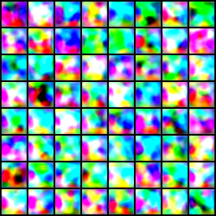</B></td>
  </tr>
  <tr>
    <td align = "center"><B>2</B></td>
    <td align = "center"><B>100</B></td>
    <td align = "center"><B>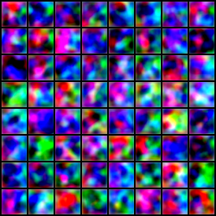</B></td>
  </tr>
  <tr>
    <td align = "center"><B>3</B></td>
    <td align = "center"><B>200</B></td>
    <td align = "center"><B>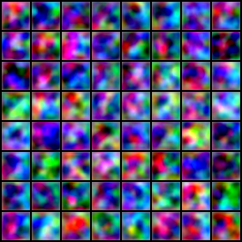</B></td>
  </tr>
  <tr>
    <td align = "center"><B>4</B></td>
    <td align = "center"><B>400</B></td>
    <td align = "center"><B>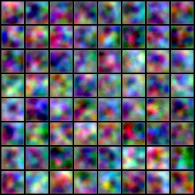</B></td>
  </tr>
  <tr>
    <td align = "center"><B>5</B></td>
    <td align = "center"><B>600</B></td>
    <td align = "center"><B>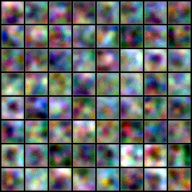</B></td>
  </tr>
  <tr>
    <td align = "center"><B>6</B></td>
    <td align = "center"><B>800</B></td>
    <td align = "center"><B>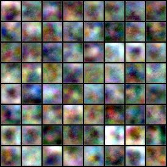</B></td>
  </tr>
  <tr>
    <td align = "center"><B>7</B></td>
    <td align = "center"><B>1000</B></td>
    <td align = "center"><B>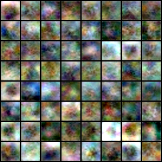</B></td>
  </tr>
  <tr>
    <td align = "center"><B>8</B></td>
    <td align = "center"><B>1500</B></td>
    <td align = "center"><B>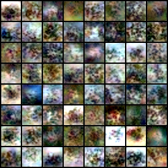</B></td>
  </tr>
  <tr>
    <td align = "center"><B>9</B></td>
    <td align = "center"><B>2000</B></td>
    <td align = "center"><B>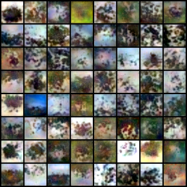</B></td>
  </tr>
  <tr>
    <td align = "center"><B>10</B></td>
    <td align = "center"><B>2500</B></td>
    <td align = "center"><B>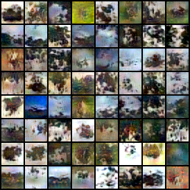</B></td>
  </tr>
  <tr>
    <td align = "center"><B>11</B></td>
    <td align = "center"><B>3000</B></td>
    <td align = "center"><B>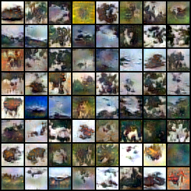</B></td>
  </tr>
</table>

